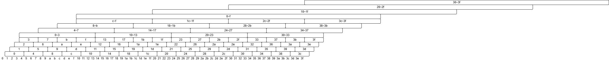

[English](README_en.md) | 日本語

# RecursiveCompressor / LogKV

階層的なkv圧縮による独自アーキテクチャ **LogKV** の言語モデル実装です。



## アーキテクチャ（LogKV）

LogKVは、系列をチャンク（C=chunk_size）単位で再帰的にattentionプーリング圧縮し、各クエリ位置が「直近C個のトークン、直近C個のC トークン要約、直近C個のC²トークン要約、…」という**多解像度の窓（C×log L 個のkvスロット）を単一のsoftmaxで参照**するattention機構です。

- 受容野は全系列、attentionあたりのkv数は O(C·log L)
- 逐次推論の隠れ状態も O(C·log L·d)（系列長に対して対数）— 生成が何万トークン続いてもメモリが増えません
- `forward` / `step`（隠れ状態持ち回りの任意長チャンク処理）/ `predict`（1トークン）が fp64 で機械精度一致するよう実装・テストされています

標準構成は以下の要素からなります（検証記録は [doc/logkv.md](doc/logkv.md)）:

| 要素 | 内容 |
|---|---|
| レベル減衰 | レベルiのロジットに −i·log C。話題執着（多重計上の正帰還）を解消し、~1/距離のrecency priorを誘導 |
| 位相埋め込み | 位置のC進数下位桁（周期16）の学習ベクトル。同一トークン連続区間の位置縮退を解消 |
| マルチヘッド | ヘッドをバッチ次元に折り畳んで適用 |
| Gated attention | sigmoid(W_g x) を各ヘッドのattention出力に乗算 |
| Self slot | クエリ自身のトークンのk/vを1スロット追加（通常のcausal maskと同じ意味論）。softmaxに「聞かない」逃げ場を与え勾配を安定化 |

言語モデル（LogKVLM）は `Embedding → LogKVBlock × num_layers → RMSNorm → Linear` で、HuggingFaceの `PreTrainedModel` を継承しています（`save_pretrained` / `from_pretrained` / `generate` 対応）。

**Copyingタスクでは、訓練ホライズン2028トークンのモデルが1670万トークン（8273倍）先からの完全コピーに成功**しています（[doc/logkv.md](doc/logkv.md) §6.13）。

## セットアップ

```bash
uv sync
cp .env.example .env
# .env の DATA_DIR を編集（データセット・チェックポイントの保存先）
```

## 使い方

### 学習（DDPデータ並列）

```bash
uv run torchrun --nproc_per_node=6 train_logkv.py \
    --run-name myrun --phase-emb --phase-levels 2 --gated-attention --self-slot
```

混合精度（fp32マスター重み + bfloat16 autocast）、Muon（隠れ層の2D重み）+ AdamW の2段オプティマイザで学習します。attention部はonline softmax + activation checkpointingでVRAMを削減しています。

学習データはHuggingFaceから自動ダウンロードされ、トークナイズ済みキャッシュ（numpy memmap）が `$DATA_DIR/hf_cache/mmap/ctx{context_length}/` に保存されます。チェックポイントは `$DATA_DIR/checkpoints_logkv/{run-name}/` に保存され、`--resume latest` で再開できます（消費済みデータをスキップして継続、`--max-steps` は絶対ステップ数）。1000ステップごとに日本語プロンプトからのサンプル生成が `samples.log` に記録されます。

#### 学習中の制御

```bash
just pause          # 一時停止（プロセス維持・GPU idle）
just resume         # 再開
just save-and-exit  # チェックポイント保存して終了 → --resume latest で再開
```

### テキスト生成

```bash
# 1回生成
uv run python predict_logkv.py --model-dir $DATA_DIR/checkpoints_logkv/myrun/checkpoint-5000/model \
    --max-new-tokens 1024 --temperature 0.7 --top-p 0.9 "日本の首都は"

# 対話的にストリーム生成（config.json からアーキテクチャを自動判別）
uv run python predict_stream.py --model-dir /path/to/checkpoint \
    --context-length 4096 --temperature 0.7 --top-p 0.9
```

### テスト・基礎実験

```bash
uv run pytest test_logkv.py test_logkv_lm.py -v   # LogKV（fp64機械精度の等価性検証を含む）
uv run pytest test_lm.py -v                       # 旧アーキテクチャ

# Copy Memory Problem / Selective Copying（長距離記憶の基礎検証）
uv run python exp/copying/train.py --arch logkv --phase-emb --phase-levels 2 --gated-attention --self-slot \
    --run-name myrun --t-dist loguniform
uv run python exp/copying/evaluate.py --run-name myrun --max-t-exp 17
```

## ファイル構成

| ファイル | 説明 |
|---|---|
| `logkv.py` | LogKVアーキテクチャ本体（`forward`/`step`/`predict`、LogKVBlock） |
| `logkv_lm.py` | 言語モデル LogKVLM（PreTrainedModel継承） |
| `configuration_logkv.py` | モデル設定（PretrainedConfig継承） |
| `train_logkv.py` | DDPデータ並列学習スクリプト（Muon + AdamW、bfloat16 autocast） |
| `predict_logkv.py` | テキスト生成（LogKV用） |
| `predict.py` / `predict_stream.py` | テキスト生成・対話的ストリーム生成（新旧アーキ自動判別） |
| `dataset.py` | HFデータセット読み込み・トークナイズ・memmapキャッシュ |
| `test_logkv.py` / `test_logkv_lm.py` | LogKVのテスト |
| `exp/copying/`, `exp/selective-copying/` | 長距離記憶の基礎実験一式 |
| `doc/logkv.md` | LogKVの設計・実験の知見まとめ |
| `.env.example` | 環境設定例 |

### 旧アーキテクチャ（RecursiveCompressor）

再帰的な圧縮・展開でチャンク間の情報伝達を行う旧実装も残っています: `recursive_compressor.py` / `recursive_compressor_lm.py` / `recursive_compressor_lm_pipeline.py` / `configuration_recursive_compressor.py` / `train_pipeline.py`（6GPUパイプライン並列、`uv run torchrun --nproc_per_node=6 train_pipeline.py`）。経緯は [doc/copying-memory-branch-changes.md](doc/copying-memory-branch-changes.md) を参照してください。

## 学習データセット

`--dataset-type` で選択:

### `pretrain` (文書データ)
| データセット | 言語 |
|---|---|
| `wikimedia/wikipedia` (20231101.ja) | 日本語 |
| `wikimedia/wikipedia` (20231101.en) | 英語 |
| `hotchpotch/cc100-ja-documents` | 日本語 |
| `JeanKaddour/minipile` | 英語 |

### `instruct` (対話データ)
| データセット | 言語 |
|---|---|
| `shi3z/ja_conv_wikipedia_llama2pro8b_30k` | 日本語 |
| `shi3z/ja_conv_wikipedia_orion14B_100K` | 日本語 |
| `HuggingFaceH4/ultrachat_200k` | 英語 |

データ形式はLlama 2スタイルで、文書は `<s>text</s>`、対話は `<s>[INST]q[/INST]a</s>` （ターンごとにBOS/EOSで囲む）です。長文は context_length 単位で分割し、短文は連結してパッキングすることで PAD による無駄を削減しています（対話データは会話間パッキングなし・応答のみloss）。

## モデルパラメータ（LogKV標準構成）

| パラメータ | 値 |
|---|---|
| d_model | 1024 |
| num_heads | 8 |
| d_ff | 3072 |
| chunk_size | 4 |
| num_layers | 16 |
| context_length | 2048 |
| phase_emb / phase_levels | 有効 / 2（周期16） |
| gated_attention | 有効 |
| optimizer | Muon (2D hidden) + AdamW (embedding/head/bias/norm/位相埋め込み) |
| learning rate | 2e-4（線形warmup 1000） |
| precision | fp32 master weights + bfloat16 autocast |
